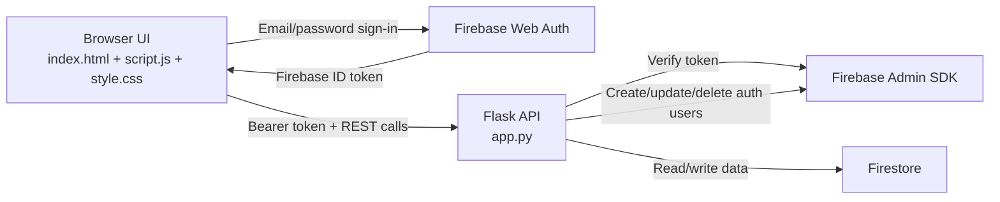
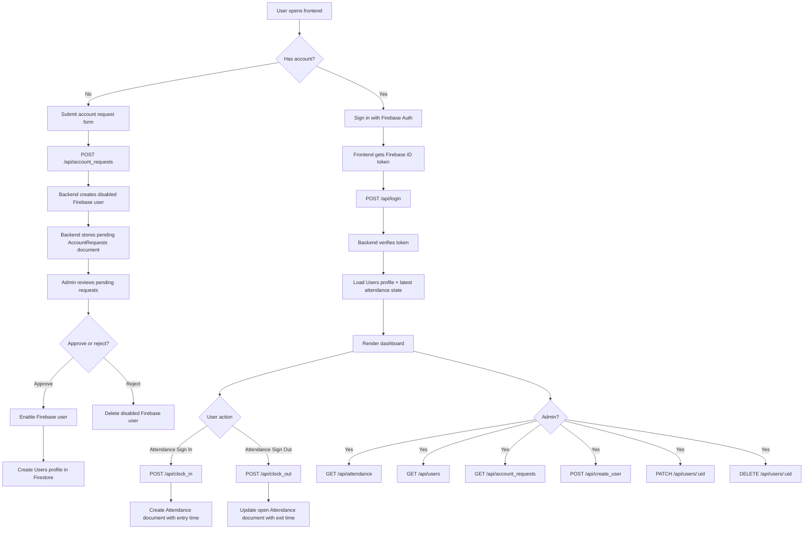

# MVJ Attendance System

Attendance and account-management platform for MVJ College of Engineering.

This project combines:

- a static frontend built with HTML, CSS, and vanilla JavaScript
- Firebase Authentication on the client for email/password login
- a Flask backend for business rules and admin operations
- Firestore for user profiles, attendance records, and account requests

The app supports two main journeys:

- staff or students can request an account, log in, and mark attendance in or out
- admins can approve requests, create users, manage user roles/status, and monitor daily attendance

## What The System Does

### End-user features

- Log in with Firebase email/password authentication
- Start attendance with `Attendance Sign In`
- End attendance with `Attendance Sign Out`
- View current session state, latest session, and live duration
- Submit an account request from the login screen

### Admin features

- Approve or reject pending account requests
- Create users directly
- View all users and update role or account status
- Delete users and automatically close any open attendance sessions
- View attendance by date
- See dashboard stats such as active users and latest login activity
- Export fetched attendance data from the frontend

## Tech Stack

| Layer | Technology | Purpose |
|---|---|---|
| Frontend UI | HTML + CSS + vanilla JavaScript | Login screen, attendance dashboard, admin dashboard |
| Client auth | Firebase Web SDK | Sign in, sign out, auth state changes, ID token generation |
| Backend API | Flask + Flask-CORS | REST API, authorization, attendance rules, admin actions |
| Admin/auth bridge | Firebase Admin SDK | Verify ID tokens, create/disable/delete Firebase users |
| Database | Firestore | Store `Users`, `Attendance`, and `AccountRequests` |
| Config | `.env` + `python-dotenv` | Local runtime configuration |
| Production app server | `gunicorn` | Backend hosting |
| Static deploy helper | `build.js` + `netlify.toml` | Optional static-site packaging/deploy flow |

## High-Level Architecture



## Full Workflow Diagram



## Runtime Flow

### 1. Authentication flow

1. The browser loads `index.html`.
2. Firebase Web SDK is initialized in the page.
3. The user signs in with email and password.
4. Firebase returns an ID token to the frontend.
5. The frontend calls `POST /api/login` with `Authorization: Bearer <id_token>`.
6. Flask verifies the token with Firebase Admin.
7. Flask reads the user profile from Firestore and returns current attendance state.
8. The frontend renders either the employee view or admin view based on the returned role.

### 2. Attendance flow

1. The authenticated user clicks `Attendance Sign In`.
2. The frontend calls `POST /api/clock_in`.
3. The backend checks that the user exists and does not already have an active session.
4. The backend creates an `Attendance` document with `entry_time` and no `exit_time`.
5. The frontend starts a live duration counter.
6. When the user clicks `Attendance Sign Out`, the frontend calls `POST /api/clock_out`.
7. The backend updates the active attendance document with `exit_time`.

### 3. Account-request approval flow

1. A new user submits the account request form from the login screen.
2. The backend creates a disabled Firebase Auth user.
3. The backend stores a pending document in `AccountRequests`.
4. An admin opens the Requests tab in the dashboard.
5. The admin accepts or rejects the request.
6. On accept, the backend enables the Firebase user and creates a `Users` profile.
7. On reject, the backend deletes the disabled Firebase user and marks the request as rejected.

## Project Structure

```text
project/
├── app.py                    # Flask backend and all API routes
├── index.html                # Main UI shell, Firebase client config, dashboard markup
├── script.js                 # Frontend behavior, auth flow, API calls, admin interactions
├── style.css                 # Styling and responsive layout
├── requirements.txt          # Python dependencies
├── Procfile                  # Production backend start command
├── .env.example              # Example backend environment configuration
├── .env                      # Local environment file (not committed)
├── .gitignore                # Git ignore rules
├── build.js                  # Static build helper for generating dist/
├── netlify.toml              # Netlify build configuration
├── dist/                     # Generated frontend output from build.js
├── serviceAcountkey.json     # Local Firebase service account key (keep private)
└── README.md                 # Project documentation
```

## Core Files And Responsibilities

### `app.py`

Backend entrypoint and API layer.

- loads Firebase Admin credentials
- configures Flask and CORS
- verifies Firebase ID tokens
- manages Firestore reads and writes
- exposes user, attendance, and account-request APIs
- enforces admin-only operations
- uses `Asia/Kolkata` as the application timezone

### `index.html`

Static application shell.

- loads fonts, CSS, and Firebase Web SDK modules
- defines Firebase client configuration
- sets `window.APP_CONFIG.apiBase`
- contains the login view, request-account form, employee dashboard, and admin dashboard

### `script.js`

Frontend controller.

- calls Firebase sign-in/sign-out APIs
- manages auth state and ID tokens
- sends requests to Flask
- updates the UI for attendance state
- powers admin tabs for attendance, users, and account requests
- auto-refreshes admin data periodically

### `style.css`

Presentation layer for:

- login screen
- attendance action panel
- admin stats cards
- tables and tabbed dashboard sections
- responsive behavior

### `build.js`

Optional static build helper that generates `dist/`.

- reads `.env`
- copies static frontend files
- attempts to inject `FIREBASE_API_KEY` into `index.html`

### `netlify.toml`

Optional Netlify configuration.

- runs `node build.js`
- publishes the generated `dist/` directory

### `Procfile`

Production backend command:

```text
web: gunicorn app:app
```

## Backend API Surface

| Endpoint | Method | Auth | Purpose |
|---|---|---|---|
| `/api/health` | `GET` | Public | Health check |
| `/api/login` | `POST` | Firebase token | Return user profile and attendance state |
| `/api/account_requests` | `POST` | Public | Submit account request |
| `/api/account_requests` | `GET` | Admin | List account requests |
| `/api/account_requests/<request_id>/accept` | `POST` | Admin | Approve request and enable Firebase user |
| `/api/account_requests/<request_id>/reject` | `POST` | Admin | Reject request and remove disabled Firebase user |
| `/api/clock_in` | `POST` | Firebase token | Start attendance session |
| `/api/clock_out` | `POST` | Firebase token | End attendance session |
| `/api/create_user` | `POST` | Admin | Create user directly |
| `/api/users` | `GET` | Admin | List all users |
| `/api/users/<target_uid>` | `PATCH` | Admin | Update role or account status |
| `/api/users/<target_uid>` | `DELETE` | Admin | Delete user and close active sessions |
| `/api/attendance` | `GET` | Admin | Fetch attendance records for a date |

## Data Model

The backend uses three Firestore collections.

### `Users`

Document id: Firebase `uid`

Typical fields:

- `uid`
- `name`
- `email`
- `role`
- `account_status`
- `created_at`

### `Attendance`

Document id: generated from `uid + timestamp`

Typical fields:

- `uid`
- `name`
- `role`
- `date`
- `entry_time`
- `exit_time`

### `AccountRequests`

Document id: request user's `uid`

Typical fields:

- `uid`
- `name`
- `email`
- `role`
- `status`
- `requested_at`
- `reviewed_at`
- `reviewed_by`

## Roles And Authorization

Supported normalized roles in the backend:

- `admin`
- `hod`
- `teaching`
- `lab_instructor`
- `student`

Authorization model:

- Firebase handles identity
- Flask verifies the Firebase ID token
- Firestore `Users` documents provide the app role
- admin-only routes check role before performing mutations

## Local Development

### Prerequisites

- Python 3.10+ recommended
- Firebase project with Authentication and Firestore enabled
- Firebase service account JSON

### Install and run

```bash
pip install -r requirements.txt
python app.py
```

### Environment variables

Copy `.env.example` to `.env` and configure:

```env
FIREBASE_SERVICE_ACCOUNT_PATH=serviceAcountkey.json
ALLOWED_ORIGINS=http://127.0.0.1:5500,http://localhost:5500
PORT=5000
FLASK_DEBUG=false
```

You can also use:

```env
FIREBASE_SERVICE_ACCOUNT_JSON={...}
```

### Important local note

The backend can currently fall back to a local `serviceAcountkey.json` placed next to `app.py` if environment variables are missing.

## Deployment Notes

### Backend deployment

The backend is designed to run as a Flask app behind `gunicorn`, which is reflected in `Procfile`.

Recommended host types:

- Render
- Railway
- any Python-compatible container or VM host

### Frontend deployment

The repo also includes a static deployment helper path:

- `build.js`
- `netlify.toml`
- generated `dist/`

### Current implementation note

The current `index.html` already contains a full Firebase client config block and a hardcoded:

```js
window.APP_CONFIG = {
  apiBase: "https://attandance-system-0w9q.onrender.com",
};
```

That means:

- the frontend is presently pointed at a hosted backend URL
- local frontend/backend development may require changing `apiBase`
- if you rely on `build.js` for deployment, keep its API-key injection behavior in sync with the actual `index.html` structure

## Operational Notes

- Backend timezone is `Asia/Kolkata`.
- CORS is applied only to `/api/*` routes.
- Attendance sessions are prevented from overlapping for the same user.
- Deleting a user closes any open attendance session before removing the profile.
- Admin user listings read both Firestore profile data and Firebase Auth disabled status.

## Suggested Future Documentation Additions

If you continue evolving the project, the next useful additions would be:

- API request and response examples
- screenshots of login, admin, and request flows
- Firestore security-rule notes
- deployment instructions for the current Render + static hosting setup
